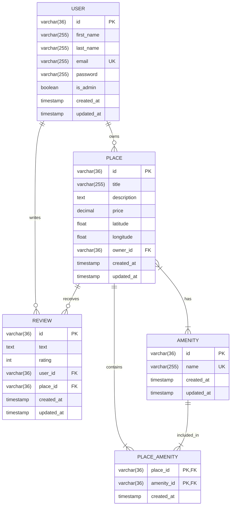
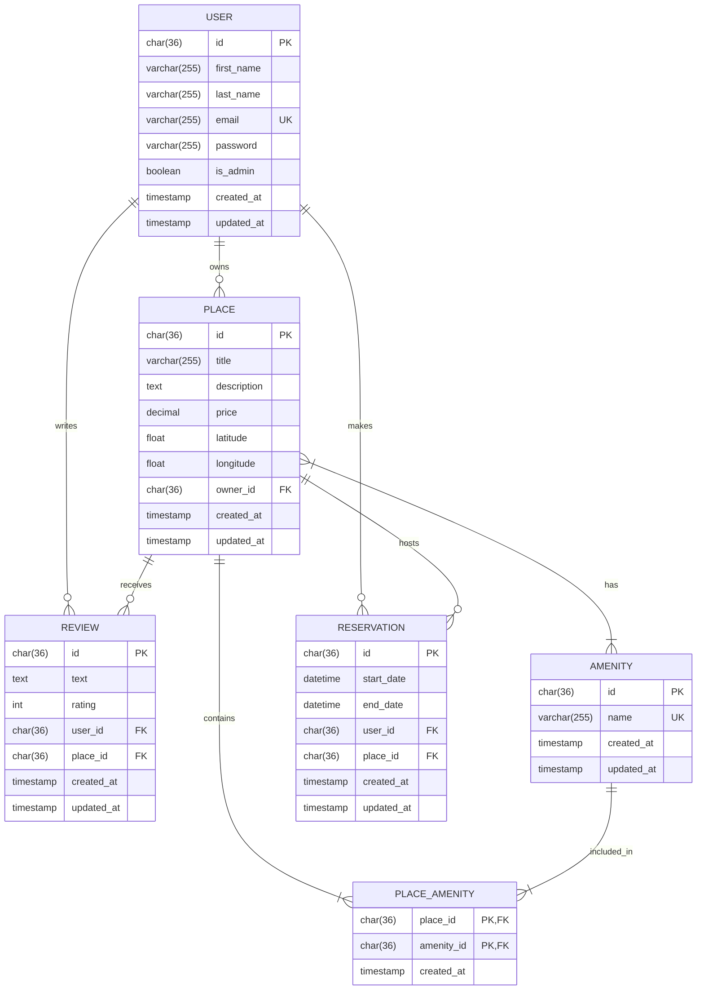

# HBNB Project

## Structure of project
```
hbnb/
 |-app
 | |-persistence
 | | |-places.py
 | | |-amenities.py
 | | |-user.py
 | | |-reviews.py
 | | |-repository.py
 | | |-__init__.py
 | |-__init__.py
 | |-api
 | | |-v1
 | | | |-reviews.py
 | | | |-__init__.py
 | | | |-auth.py
 | | | |-amenities.py
 | | | |-admin.py
 | | | |-users.py
 | | | |-places.py
 | | |-__init__.py
 | |-models
 | | |-place.py
 | | |-review.py
 | | |-base.py
 | | |-user.py
 | | |-amenity.py
 | | |-__init__.py
 | |-services
 | | |-__init__.py
 | | |-facade.py
 |-diagram.md
 |-instance
 | |-development.db
 |-tests
 | |-test_02_places.py
 | |-test_05_admin.py
 | |-test_04_amenities.py
 | |-conftest.py
 | |-utils.py
 | |-test_database.sql
 | |-test_01_users.py
 | |-test_03_reviews.py
 | |-create_database.sql
 |-README.md
 |-requirements.txt
 |-config.py
 |-run.py
```

**Explanation:**
- The `app/` directory contains the core application code.
- The `api/` subdirectory houses the API endpoints, organized by version (`v1/`).
- The `models/` subdirectory contains the business logic classes (e.g., `user.py`, `place.py`).
- The `services/` subdirectory is where the Facade pattern is implemented, managing the interaction between layers.
- The `persistence/` subdirectory is where the in-memory repository is implemented. This will later be replaced by a database-backed solution using SQL Alchemy.
- The `tests` directory is used to test api models and endpoints via unittest.
- `run.py` is the entry point for running the Flask application.
- `config.py` will be used for configuring environment variables and application settings.
- `requirements.txt` will list all the Python packages needed for the project.
- `README.md` will contain a brief overview of the project.


### Command
```markdown
#Run server:
    python run.py

#Run api test (tests folder):
    pytest -s -v --disable-warnings

#Create database and test (tests folder):
    mysql -hlocalhost -u <user> -p <create_database.sql || test_database.sql>
```

### Database diagram



