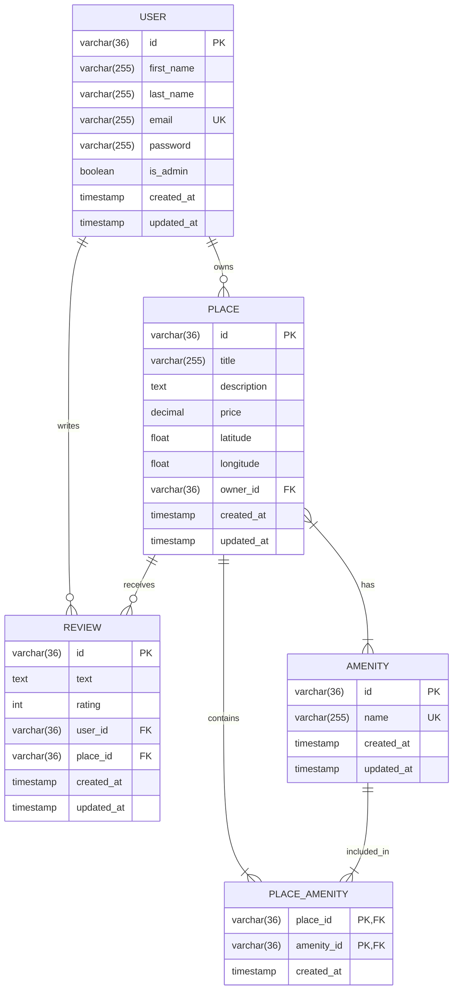
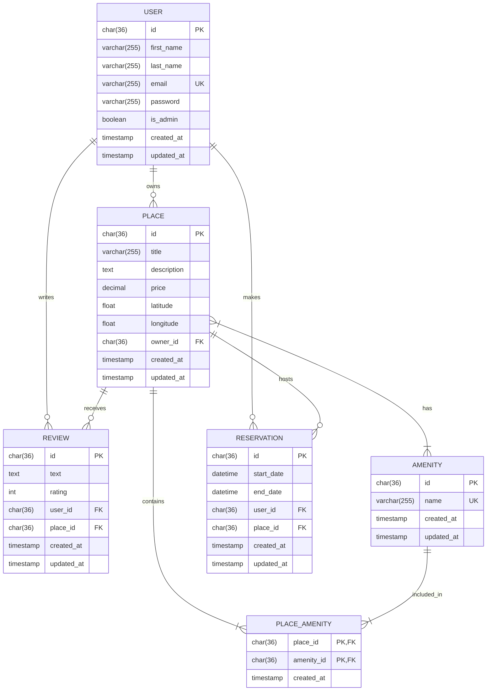

# HBNB Project

## Structure of project
```
hbnb/
 |-app/
 | |-api/
 | | |-v1/
 | | | |-reviews.py
 | | | |-__init__.py
 | | | |-auth.py
 | | | |-amenities.py
 | | | |-admin.py
 | | | |-users.py
 | | | |-places.py
 | | |-__init__.py
 | |-models/
 | | |-place.py
 | | |-review.py
 | | |-base.py
 | | |-user.py
 | | |-amenity.py
 | | |-__init__.py
 | |-persistence
 | | |-places.py
 | | |-amenities.py
 | | |-user.py
 | | |-reviews.py
 | | |-repository.py
 | | |-__init__.py
 | |-services/
 | | |-__init__.py
 | | |-facade.py
 | |-__init__.py
 |-config.py
 |-README.md
 |-requirements.txt
 |-run.py
```

**Explanation:**
- The `app/` folder serves as the core of the application, housing its main components.
- Within `api/`, you’ll find the API routes categorized by version (`v1/`) for better organization.
- The `models/` directory defines the core business logic and entities like `user.py` and `place.py`.
- The `persistence/` folder currently implements in-memory storage, which will later transition to a database-backed system with - SQLAlchemy.
- The `services/` directory contains a Facade layer that orchestrates interactions between different components.
- The `config.py` file handles application settings and environment configurations.
- The `README.md` provides an overview of the project, offering context for developers.
- The `requirements.txt` lists all required Python packages for the project to function.
- The `run.py` script is the main entry point to start the Flask application.


### Command
```markdown
#Run server:
    python run.py

#Run api test (tests folder):
    pytest -s -v --disable-warnings

#Create database and test (tests folder):
    mysql -hlocalhost -u <user> -p <create_database.sql || test_database.sql>
```

### Diagrams



